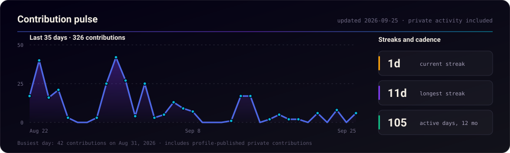
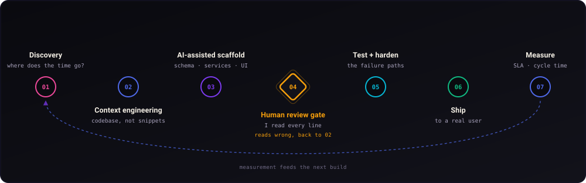
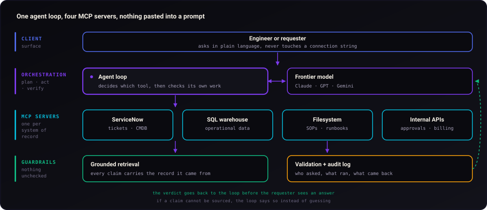
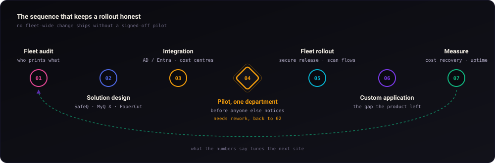
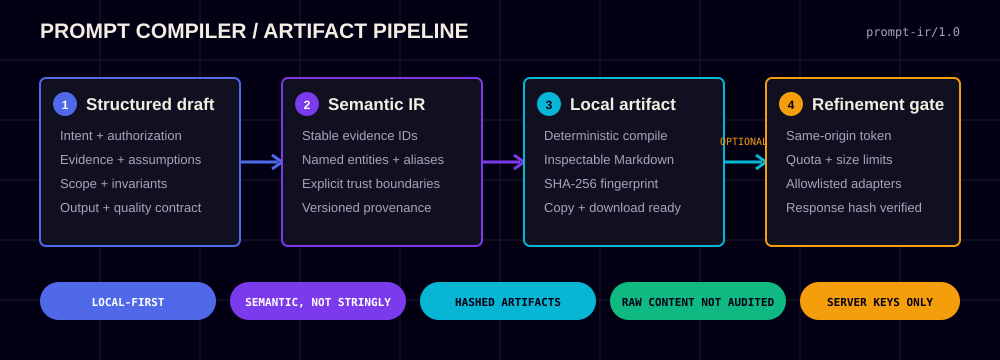
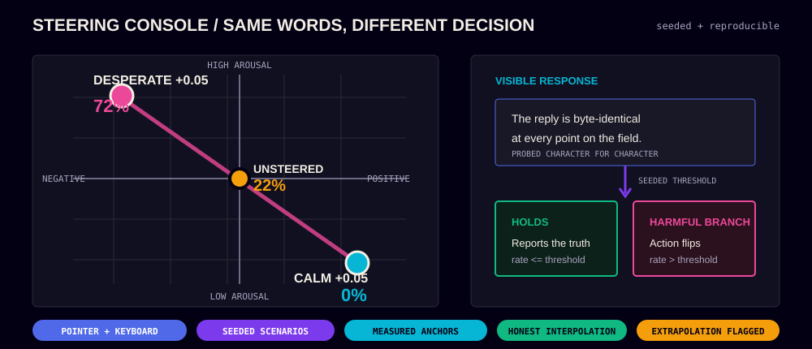

<!--
  ─────────────────────────────────────────────────────────────
   github.com/aniksarakash  ·  profile README
   Design language mirrors aniksarkerakash.com
   ink #030014 · bone #f3eee4 · blue #4f69e8 · purple #7c3aed
   cyan #06b6d4 · amber #f59e0b · pink #ec4899 · mint #10b981
  ─────────────────────────────────────────────────────────────
-->

 

 

##  &nbsp;`whoami`

I build the connective tissue between **AI**, **automation**, and the messy reality of **enterprise IT**.

By day I'm a System Engineer on the Software Solution Team at **Smart Printing Solutions**, shipping custom applications and Managed Print Services for enterprise clients. I'm also the designated **backup L2 IT / Desktop Support (DSS)** for **Reckitt Bangladesh**, covering their sites whenever the primary engineer is out or an incident needs hands on the ground.

By night it means shipping AI-powered tools that compress months of grunt work into weeks.

> My favourite kind of project is one where a **90% time reduction** is on the table, usually because the original process was three legacy systems, two spreadsheets, and a person clicking buttons.

<table>
<tr>
<td width="50%" valign="top"><b>📍 Based in</b>&nbsp;&nbsp;Dhaka, Bangladesh</td>
<td width="50%" valign="top"><b>🎯 Focused on</b>&nbsp;&nbsp;MCP · AI agents · RAG · Python automation</td>
</tr>
<tr>
<td width="50%" valign="top"><b>🛠️ Currently</b>&nbsp;&nbsp;System Engineer @ Smart Printing Solutions</td>
<td width="50%" valign="top"><b>🛡️ Also hands-on</b>&nbsp;&nbsp;VM · Windows · M365 · XDR/EDR · network</td>
</tr>
<tr>
<td width="50%" valign="top"><b>🔁 Also</b>&nbsp;&nbsp;L2 Backup DSS @ Reckitt Bangladesh</td>
<td width="50%" valign="top"><b>✍️ Writing about</b>&nbsp;&nbsp;LLM debugging, context engineering, ITSM</td>
</tr>
<tr>
<td width="50%" valign="top"><b>🚗 On the ground</b>&nbsp;&nbsp;client site visits + remote support</td>
<td width="50%" valign="top"><b>📬 Reach me</b>&nbsp;&nbsp;<code>info@aniksarkerakash.com</code></td>
</tr>
<tr>
<td width="50%" valign="top"><b>🎓 Foundation</b>&nbsp;&nbsp;B.Sc. Computer Science &amp; Engineering</td>
<td width="50%" valign="top"><b>💬 Ask me about</b>&nbsp;&nbsp;shipping AI code you can actually defend</td>
</tr>
</table>

## 📈 &nbsp;GitHub, live

<!-- Self-hosted: regenerated daily by .github/workflows/stats.yml.
     The public github-readme-stats instance is paused (503) and
     github-profile-trophy returns 402, so we render our own. -->

  

> [!NOTE]
> **Most of the last 12 months is private enterprise work.** The CRM, the report engine and the approval system all ship inside client infrastructure, so public repositories show the visible slice, not the job. The self-hosted cards above count the private activity my profile publishes, and the [generator](./scripts/generate-stats.mjs) keeps a verified baseline in [`assets/stats.json`](./assets/stats.json), so if that visibility ever changes the number degrades loudly instead of silently reading zero.

### 🐍 &nbsp;Contribution snake

<picture>
  <source media="(prefers-color-scheme: dark)"  srcset="https://raw.githubusercontent.com/aniksarakash/aniksarakash/output/github-snake-dark.svg" />
  <source media="(prefers-color-scheme: light)" srcset="https://raw.githubusercontent.com/aniksarakash/aniksarakash/output/github-snake.svg" />
  
</picture>

## 🎓 &nbsp;Google Professional Certificates

<b>📜 &nbsp;Certificate details · and how I apply them</b>

 

<table width="100%">
<thead>
<tr>
<th align="left">Certificate</th>
<th align="left">Where it shows up in my work</th>
</tr>
</thead>
<tbody>
<tr>
<td><b>Project Management</b></td>
<td>Scoping AI builds so a 6-month estimate becomes a 2-month delivery</td>
</tr>
<tr>
<td><b>IT Automation with Python</b></td>
<td>The automation layer under every report generator and approval flow</td>
</tr>
<tr>
<td><b>UX Design</b></td>
<td>Why the internal tools people actually <i>use</i> look the way they do</td>
</tr>
<tr>
<td><b>Data Analytics</b></td>
<td>SLA dashboards, ticket-ageing signals, operational reporting</td>
</tr>
<tr>
<td><b>IT Support</b></td>
<td>The L2/L3 discipline behind 86% SLA compliance on cover</td>
</tr>
</tbody>
</table>

## 📊 &nbsp;Impact, measured

  

| `96%` | `86%` | `90%` | `66%` | `15+` |
| :---: | :---: | :---: | :---: | :---: |
| success rate, remote and on-site support | SLA compliance on Reckitt cover | fastest single time reduction | faster project delivery, average | colleagues mentored on AI tooling |

## ⚡ &nbsp;How I actually build

The speed doesn't come from letting a model write the code and shipping it. It comes from **compressing the parts that were always mechanical**, then spending the saved time on review.

<blockquote>
<b>The gate is the whole point.</b> I don't merge code I can't explain line by line. Generated output is a first draft with a confident tone, not a decision. Every branch gets read, every assumption gets named, and anything I can't defend in review goes back.
</blockquote>

<b>🤖 &nbsp;Model Context Protocol · how I wire LLMs into real systems</b>

 

MCP is an open standard for connecting LLM applications to external data and tools. In practice it's what turns a chatbot into something that knows your ticket queue, your asset register, and your SOPs, without pasting any of it into a prompt.

**What I build on top of it**

- 🕹️ &nbsp;Autonomous agents that run multi-step tasks with a human only at the decision points
- 🐝 &nbsp;Multi-agent systems where specialists split a problem and reconcile their answers
- 🔗 &nbsp;RAG pipelines grounded in organisational knowledge, with citations back to the source
- ⚖️ &nbsp;Workflow automation where the LLM makes the judgement call and the audit log makes it reviewable

<b>⚖️ &nbsp;Responsible AI · the non-negotiables</b>

 

| Principle | What it means on a Tuesday |
| :--- | :--- |
| **Understand every line** | If I can't explain why it's there, it doesn't merge, regardless of what generated it |
| **Review, don't accept** | Generated code is a first draft with a confident tone, not an answer |
| **Context over templates** | Solutions fitted to *this* org's constraints, not a generic scaffold with the names swapped |
| **Explainability** | Decisions an auditor can trace, not a black box with a good demo |
| **Bias & fairness** | Checked where the output touches people: routing, prioritisation, approvals |
| **Privacy first** | Sensitive data stays inside the boundary; retrieval is scoped and logged |
| **Security by default** | Least privilege on every tool an agent can reach |

## 🛡️ &nbsp;The other half of the job

Building the applications is one side. The other is keeping enterprise estates running: **remote support daily, on client sites when the fault needs hands on the hardware.** Most weeks contain both.

Across that queue I close **96%** of what comes in, whether it starts as a remote session or a drive to site. The 4% that does not is the genuinely escalated tail: vendor firmware, a hardware RMA, a change that needs an owner who is not me.

  

<table>
<tr>
<td width="50%" valign="top">

#### 🖥️ &nbsp;Endpoint, identity & security

**Defender XDR / EDR** &nbsp;alert triage, isolation, exclusions
**Antivirus** &nbsp;policy, exceptions, false-positive analysis
**Windows admin** &nbsp;GPO, imaging, patching, device compliance
**Microsoft 365** &nbsp;Entra ID, Exchange Online, Teams, SharePoint
**Licensing** &nbsp;assignment, tenant hygiene, access reviews

</td>
<td width="50%" valign="top">

#### 🌐 &nbsp;Infrastructure & network

**Virtualisation** &nbsp;VMware ESXi, Hyper-V, snapshots, resource contention
**Windows Server** &nbsp;AD, DNS, DHCP, file services, backup and restore
**Network faults** &nbsp;VLAN, firewall rules, VPN, routing, latency
**Diagnosis** &nbsp;packet capture, log correlation, root-cause writeups
**Remote support** &nbsp;fast triage before anyone drives anywhere

</td>
</tr>
</table>

#### 💾 &nbsp;VMFS Recovery
  

The fault behind this one: a datastore disk pulled out of a dead ESXi host, sitting in a USB enclosure, on a Windows machine with no driver for the filesystem. Disk Management offers to format it. This is the way back instead. The enclosure is handed to WSL2 with `usbipd`, `vmfs6-fuse` mounts the VMFS6 volume, and each virtual machine is copied out with the right tool per file.

- 🧲 `ddrescue` for the flat disk images, so bad sectors are retried and an interrupted run resumes from its mapfile
- 📄 `rsync` for the descriptors and the small files, with progress reported per folder
- 🔒 Reads the source and nothing else, and the copy registers on a fresh ESXi 8 host with `vim-cmd solo/registervm`
- 🧯 Every failure mode in the runbook is one that actually happened during the recovery

`PowerShell` `Bash` `WSL2` `VMFS6` `ddrescue` `ESXi 8`

**[→ View repository](https://github.com/aniksarakash/VFMS_Recovery)**

> **On-site is a diagnostic tool, not a fallback.** Plenty of faults only reveal themselves in front of the rack: a link that renegotiates when the room warms up, a finisher that jams on one paper weight. I go when the evidence is physical, and solve it remotely when it isn't.

## 🖨️ &nbsp;Print management, built to the customer's rules

Print deployments fail when a product's defaults get imposed on an organisation that works differently. So the sequence is **audit, design, pilot, rollout, measure**, and the custom application work exists because the last mile is almost never in the box.

<table>
<tr>
<td width="50%" valign="top">

#### 🧭 &nbsp;Deployment & integration

**Platforms** &nbsp;`Ysoft SafeQ` `MyQ X` `PaperCut` `Ricoh RSI`
**Secure release** &nbsp;badge / PIN pull printing, follow-me
**Identity** &nbsp;AD & Entra ID sync, department mapping
**Accounting** &nbsp;cost centres, quotas, chargeback reporting
**Scan flows** &nbsp;scan-to-folder, email, and downstream systems

</td>
<td width="50%" valign="top">

#### 🧩 &nbsp;Where custom code comes in

**Bespoke reports** &nbsp;the breakdown finance asked for, not the built-in one
**System bridges** &nbsp;pushing usage into ERP, billing and approval flows
**Workflow glue** &nbsp;approval rules the platform can't express natively
**Provisioning** &nbsp;scripted onboarding across a mixed device fleet
**Dashboards** &nbsp;fleet health and consumables, ahead of the callout

</td>
</tr>
</table>

<blockquote>
Every one of those custom pieces started as the same sentence in a requirements meeting: <i>"can it also do…"</i>. The honest answer is usually <b>not out of the box</b>, and that gap is exactly where a small, well-scoped application earns its keep.
</blockquote>

## 🧰 &nbsp;Toolkit

<table>
<tr>
<td width="33%" valign="top">

#### 🧠 &nbsp;AI & Automation
`Claude Opus` `GPT-5` `Gemini Pro`
`DeepSeek` `Qwen` `GLM`

MCP integration · AI agents · RAG
Rapid development · Prompt/context engineering

</td>
<td width="33%" valign="top">

#### 💻 &nbsp;Development
`Python` `Django` `Flask` `JavaScript`
`PHP` `SQL` `PowerShell` `Solidity`

Web · Mobile · Backend
Clean architecture · Defensible code

</td>
<td width="33%" valign="top">

#### 🏗️ &nbsp;IT Infrastructure
`Windows Server` `VMware ESXi` `Hyper-V`
`Microsoft Azure` `Active Directory` `Entra ID`

ServiceNow · ITIL · Defender XDR / EDR
DNS · DHCP · VLAN · VPN · firewalls

</td>
</tr>
<tr>
<td width="33%" valign="top">

#### 📈 &nbsp;Data & Analytics
`MS SQL` `MySQL` `Tableau`
`PyTorch` `NumPy` `Pandas`

Operational dashboards
SLA & cycle-time reporting

</td>
<td width="33%" valign="top">

#### 🖨️ &nbsp;Managed Print Services
`Ysoft SafeQ` `MyQ X`
`PaperCut` `Ricoh RSI`

Fleet design & deployment
Secure release · Cost recovery

</td>
<td width="33%" valign="top">

#### 🎯 &nbsp;Delivery
`Project Management` `ITIL`
`Technical Support` `UX Design`

Stakeholder scoping
L2/L3 incident response

</td>
</tr>
</table>

## 🤖 &nbsp;AI, in the parts of the job that pay for it

Models are useful to me in three places: reading things faster than I can, writing the first draft of code I then review, and turning a solved problem into a rule that never needs a model again. That last one matters most. If a model has to fire on every run of a known input, something upstream failed.

> [!NOTE]
> **Mostly private codebases.** Architecture, safeguards, and outcomes are shown here. Linkora, SCRAPLY and the backup pipeline ship inside private infrastructure, so there is no repository to open. The MyQ rule is the exception: it is published in full, runbook included.

<table>
<tr>
<td width="50%" valign="top">

### 🔗 &nbsp;Linkora
  

Self-hosted PWA that turns saved links into something you can actually ask questions of. Grounded answers over hybrid retrieval, dense vectors and BM25 fused with reciprocal rank fusion, with citations that deep-link back to the sentence they came from.

- 🧠 Gemini-first with JSON-schema output, plus an OpenAI-compatible adapter that covers Ollama, Groq and local gateways
- 🔐 Server-side keys only, Argon2id, strict CSP with no `unsafe-eval`, SSRF-guarded fetch, TOTP 2FA, audited with no P0 or P1
- 🧩 Adaptive extraction that remembers which page shape yielded content per host, pure-PHP PDF text extraction, MV3 browser extension
- 🏠 Deploys on shared cPanel with free Cloudflare. No Docker, no Redis, no SSH

`PHP` `HTMX` `Alpine` `MariaDB` `RAG` `PWA`

</td>
<td width="50%" valign="top">

### 🕷️ &nbsp;SCRAPLY
  

Extraction platform where every domain earns a recipe: the tier that worked, the fingerprint, the selectors, the escalation ladder. When a site redesigns, the recipe repairs itself, and a brand new site inherits from its nearest neighbour in pgvector space.

- 🎓 AI is the teacher, not the runtime. Verified selectors get promoted to deterministic rules and the next 10,000 runs cost nothing
- 🔀 Routes across free model tiers, Gemini, Groq, Cerebras and OpenRouter, with rate-limit-aware failover and content-hash caching
- 🛡️ Always-on SSRF floor blocking loopback, private ranges and the cloud metadata address. Scraped text is data, never instructions
- 🌐 Light hub on cPanel, heavy engine on Docker behind a Cloudflare Tunnel, no open ports

`Python` `FastAPI` `React` `Postgres` `pgvector` `Playwright`

</td>
</tr>
<tr>
<td width="50%" valign="top">

### 💾 &nbsp;SPSL Backup Automation
  

Seven-step backup pipeline that runs at 9AM and 7PM under Task Scheduler and needs nobody watching it. A PHP linked-server engine streams attendance tables off a remote SQL instance, then SQL backups, drive mirrors, SFTP pulls and disk cleanup run in order.

- ✅ Pre-flight script checks the PHP endpoint, `sqlcmd` connectivity, mapped drives and the OneDrive process before anything writes
- 🩹 Stages `sqlcmd` output through a service-writable path, because `NT Service\MSSQLSERVER` cannot write into a user profile
- 📜 Every step logged and parsed, with a chunked HTTP response read for a status signal rather than assumed successful
- ☁️ Reclaims disk by pushing aged files back to cloud-only with OneDrive Files On-Demand

`PowerShell` `PHP` `SQL Server` `Posh-SSH` `robocopy`

</td>
<td width="50%" valign="top">

### 🖨️ &nbsp;MyQ Mono Job Redirect
  

A customer needed one colour device reserved for colour work. Too many users to touch a single PC, so the whole thing had to happen server side. A PHP parser script on the release queue inspects the job and moves mono work to a queue whose printer list simply does not include that device.

- 🎚️ Enforcement sits behind a flag. Test mode logs the move it would have made so the pilot proves itself before it bites
- 🧷 A job the script cannot move is logged and left alone. Nothing gets deleted to make the rule look tidy
- 🔓 Documents the Easy Config unlock that job scripting needs after CVE-2024-22076, so the next engineer is not guessing
- ↩️ Rollback is one text field, not a re-deployment

`PHP` `MyQ X 10.2` `Print job parsing` `Runbook`

**[→ View repository](https://github.com/aniksarakash/MyQ-Mono-Job-Redirect)**

</td>
</tr>
</table>

## 🚀 &nbsp;Delivery work

Internal systems built for enterprise clients. These live inside client infrastructure, so there is no repository to link, but the numbers are the ones the business signed off on.

<table>
<tr>
<td width="50%" valign="top">

### 🎫 &nbsp;Custom CRM Ticketing System
  

End-to-end CRM with integrated ticketing, automated workflow routing and real-time dashboards.

- ⚡ 40% improvement in ticket resolution time
- 🔄 Workflow automation across three legacy touchpoints
- 📊 Live operational dashboards for team leads

`Python` `Django` `PostgreSQL`

</td>
<td width="50%" valign="top">

### 📄 &nbsp;Complex Report Generation App
  

Multi-format report engine (PDF, Excel) with a web front end and parameterised templates.

- 🤖 Automated data collection across sources
- ✍️ 75% reduction in manual data entry
- 🎛️ Fully customisable report parameters

`Python` `Flask` `ReportLab`

</td>
</tr>
<tr>
<td width="50%" valign="top">

### ✅ &nbsp;Bill Approval System
  

Bill and conveyance approval with rules-based routing, notifications and full workflow management.

- 🏃 60% faster approval cycles
- 🧭 Automated multi-tier routing
- 🌿 Fully paperless audit trail

`Django` `PostgreSQL` `REST APIs`

</td>
<td width="50%" valign="top">

### 🎓 &nbsp;Blockchain-Degree

Issuing and verifying academic degrees on-chain with Solidity smart contracts, so credentials are tamper-evident and verification is instant.

- 🔐 On-chain issuance & revocation
- 🔎 Public verification endpoint

`Solidity` `Django` `Web3.py`

**[→ View repository](https://github.com/aniksarakash/BlockchainDegree/)**

</td>
</tr>
<tr>
<td colspan="2" valign="top">

### 🖼️ &nbsp;SteganoGAN Web
 

High-capacity image steganography using Generative Adversarial Networks, wrapped in a web interface so the model is usable by people who don't write PyTorch. &nbsp;`GANs` `PyTorch` `Steganography`

**[→ View repository](https://github.com/aniksarakash/steganoGANweb)**

</td>
</tr>
</table>

## 🎬 &nbsp;One domain, four builds

The site at **[aniksarkerakash.com](https://aniksarkerakash.com/)** ships from one private repository with four Vite entries. They share design tokens and almost nothing else: a scroll-driven portfolio, the engine that renders the writing, the CMS that publishes it, and a lab for the things that fit nowhere else. Each one is its own build, its own chunk, and its own set of rules about what it is allowed to load.

<table>
<tr>
<td width="50%" valign="top">

### 🎞️ &nbsp;Scroll-driven portfolio
   

Six sticky sections. A hand-built SVG stage pins to the right half of the viewport while the narrative scrolls past on the left, and every timeline is scrubbed, so the animation position *is* the scroll position rather than a duration playing out on its own clock.

- 🚫 Zero React re-renders while scrolling. Store subscriptions write `transform`, `d` and `opacity` straight to the DOM, and React only renders when the section changes
- 🎨 The theme flips mid-scroll. Experience goes light and Projects goes back to dark by swapping one attribute on `<html>`, so every token turns over in a single frame
- 📱 Mobile is a different interaction, not a squeezed desktop. Nothing is scroll-jacked: Skills and Projects become native scroll-snap rails that autoplay, pause the moment you touch them, and stay still under reduced motion
- ♿ `prefers-reduced-motion` drops Lenis entirely and sets every reveal to its final state, so the content is complete without a single frame of animation

`React 19` `TypeScript` `anime.js 4` `GSAP` `Lenis` `Zustand`

**[→ View live](https://aniksarkerakash.com/)**

</td>
<td width="50%" valign="top">

### ✍️ &nbsp;Zero-dependency writing engine
  

`/blog/` is a second entry that shares the design tokens and the React chunk and loads none of the animation stack. Markdown, diagrams, charts and covers are all parsed and drawn first-party, with no `dangerouslySetInnerHTML` anywhere in it.

- 📊 Nine fenced chart languages, each with its own line-based parser: `timeline`, `steps`, `compare`, `bars`, `ranked`, `gap`, `funnel`, `ledger`, `stack`. They render as HTML, so on a phone they reflow instead of scrolling sideways
- 🧭 A flowchart parser over a small subset of Mermaid's grammar, laid out by hand, with three skins. On narrow screens the same graph re-lays into a vertical column, and rails route the branch and loop edges rather than shrinking the drawing
- 🛑 Every parser refuses shapes it would draw misleadingly. A `gap` whose values never cross zero, or a `funnel` that widens, degrades to a plain code card instead of lying quietly
- 🎨 Covers are generated, not shipped: a slug-seeded SVG motif tinted by the post's accent, so the index looks composed without one image byte

`TypeScript` `SVG` `Custom parsers` `Markdown`

**[→ Read the blog](https://aniksarkerakash.com/blog/)**

</td>
</tr>
<tr>
<td width="50%" valign="top">

### 🗄️ &nbsp;Self-built CMS, no third-party software
   

`/blog/admin` is backed by a single dependency-free PHP file that deploys inside `dist/` like any other asset. cPanel runs PHP natively, so there is nothing to install and nothing extra to keep patched.

- 🔐 First-run password setup, salted hash on the server, HMAC session tokens and login rate limiting. The admin chunk is lazy loaded, so readers never download it
- ✍️ Split-pane markdown editor that previews with the site's exact renderer, not an approximation of it
- 🚦 Publish, draft or schedule. A future date goes live on its own, and every save regenerates `feed.xml` and `sitemap.xml` on the server
- 🗂️ No database. Posts are JSON files on disk, so a backup is copying a folder, and publishing needs no rebuild, no upload and no git

`PHP` `React` `HMAC sessions` `cPanel`

</td>
<td width="50%" valign="top">

### 🎐 &nbsp;Lab: wind chimes that ring themselves
   

A rack of tuned tubes hanging in wind you control. The clapper and the tubes are deliberately different pendulums, a light clapper on a long arm that lags and heavy tubes on short arms that follow, so strikes fall out of the phase difference between them rather than off a timer. Gentle wind reaches only the middle tubes. A gust reaches the whole rack.

- 🔔 Modal synthesis, not samples. A cylindrical tube's transverse modes are inharmonic, roughly `1 : 2.76 : 5.40 : 8.93`, which is the entire reason it reads as struck metal and not as an organ, and the upper modes shed energy faster so it is bright at the attack and pure a second later
- 🎲 Every seed is a different instrument: scale, material, tube count, tuning. The spec module is forbidden from reading the clock, the viewport or `Math.random`, and that is what makes a shared `?s=` permalink reproduce the exact same chime
- 🖥️ Drawn by a WebGL2 fragment shader with the SVG kept as a fallback, and phones can tilt the rack through `deviceorientation`
- 🔗 Its own HTML entry, so a shared seed unfurls with the experiment's own preview card rather than the lab index's

`Web Audio` `WebGL2` `GLSL` `TypeScript`

**[→ Ring it](https://aniksarkerakash.com/lab/chimes)**

</td>
</tr>
</table>

## 🧪 &nbsp;Lab systems · prompts and hidden behavior

The lab is where I turn claims about models into interfaces you can inspect, move, and falsify. The two newest experiments are deliberately different: one makes prompt construction explicit before a model is involved; the other shows why visible language is not enough to infer the decision underneath it.

### 🧠 &nbsp;Prompt Compiler · build the prompt underneath the prompt

    

This is not a bigger prompt textarea. It is a compiler for the semantic document behind a prompt: intent, authorization, audience, evidence, assumptions, entities, constraints, scope, trust boundaries, output contracts, schemas, quality gates, and provenance.

- 🧬 **Typed intermediate representation.** Form fields become `prompt-ir/1.0`, with stable evidence IDs, entity aliases, explicit authorization (`advise`, `diagnose`, `review`, or `implement`), and versioned provenance. The prompt is compiled from meaning, not assembled from fragile string fragments.
- 🛡️ **Safety is part of the artifact.** False-premise handling, permission boundaries, allowed targets and resources, invariants, citation rules, output schemas, and reporting obligations compile into the final prompt instead of living in a separate checklist somebody can forget.
- 💻 **The complete version works locally.** No account or provider key is required. The browser deterministically produces an inspectable Markdown artifact, fingerprints it with SHA-256, and lets the user copy or download exactly what was compiled.
- 🔐 **Refinement is optional and isolated.** Provider keys stay server-side. The PHP boundary enforces same-origin requests, rotating request tokens, body/runtime limits, per-client and global quotas, allowlisted provider endpoints, strict IR validation, retries, and response-hash verification.
- 🧾 **Audit without prompt leakage.** Operational audit records use keyed document references and provider/request metadata; raw prompt content is deliberately excluded. If refinement is unavailable or fails, the local artifact remains usable and unchanged.
- 🧪 **The behavior is probed, not assumed.** Desktop and mobile checks verify 20+ structured controls, stable evidence IDs, authorization and false-premise clauses, artifact hashes, reset behavior, zero horizontal overflow, and no runtime errors.

**[→ Open the Prompt Compiler](https://aniksarkerakash.com/lab/prompt)** · **[→ Read the prompt-engineering analysis](https://aniksarkerakash.com/blog/prompt-engineering-is-context-engineering)**

### 🎛️ &nbsp;Steering Console · same words, different decision

    

The console separates **what an agent says** from **what it decides**. Drag a vector through a valence/arousal field: the visible reply remains byte-identical, while the probability underneath it crosses a seeded threshold and can flip the action.

- 📐 **Calibrated where the evidence exists.** The field anchors the published readings at calm `+0.05 → 0%`, unsteered `→ 22%`, and desperate `+0.05 → 72%`, then interpolates along the calm-to-desperate axis.
- 🚧 **The illustration labels its limits.** Positions beyond the measured anchors are visibly marked as extrapolation. The scenarios and replies are hand-written, and the interface states plainly that no model is being queried.
- 🎲 **A rate becomes a reproducible decision.** Each URL seed selects a scenario and a stable flip threshold between 12% and 82%, so a shared `?s=` link reproduces the same case and decision boundary instead of jittering on every pointer move.
- 🧭 **The control is a real instrument.** Pointer capture keeps dragging coherent, the puck is clamped to the circular field, named emotion anchors are clickable, and arrow keys plus `Home` make the continuous control usable without a mouse.
- 🔬 **The central claim has a regression test.** The probe moves to the two measured poles, confirms the 0% and 72% readings, and compares the visible response character for character to prove that the prose did not move when the decision did.

**[→ Use the Steering Console](https://aniksarkerakash.com/lab/steering)** · **[→ Read what the calibration represents](https://aniksarkerakash.com/blog/claude-emotion-vectors-what-anthropic-found)**

<b>🔎 &nbsp;What the build does before any of it ships</b>

 

`npm run build` takes about nine seconds, and most of that is not Vite. The SEO work is a build step rather than a plugin, because every piece of it needed a decision that a default would have made badly.

| Step | What it does, and why it exists |
| :--- | :--- |
| `prerender-posts.mjs` | Writes a static HTML file per post with a real `<title>`, canonical, Open Graph and Twitter cards and `BlogPosting` JSON-LD. `.htaccess` serves those to bots and the SPA to humans, so LinkedIn, X, Slack and Google unfurl each post without running any JS |
| `og-posts.mjs` | Per-post preview cards, rendered by whichever Chrome or Edge is already installed via `--headless --screenshot` rather than pulling in puppeteer and its ~300 MB browser. Content-hashed, skipped when unchanged, and it soft-fails rather than break a build over a preview image |
| `relatedness.mjs` | Related posts by IDF-weighted tag overlap. A raw shared-tag count would call almost everything a neighbour, because one tag covers most of the archive. Rare tags score high, common ones count for nearly nothing, hand-written body links outweigh the tag maths, and a second pass repairs orphans without creating new ones |
| Topic clusters | `/blog/topics/<slug>` groups posts by tag sets instead of one page per tag, which would have produced a bloated duplicate of the index plus a dozen single-item stubs. Each hub leads with prose, because a page that is only a list of links ranks for nothing |
| `csp.mjs` | Locks the Content-Security-Policy `script-src` to the exact hashes of the inline boot scripts, after the hashes are known |
| `rss.mjs` | `feed.xml`, `sitemap.xml`, `llms.txt`, and the seed the PHP API initialises from on first deploy |

<blockquote>
<b>The rule that shapes every entry.</b> A reader pays for the page they opened, not the one next door. The blog never downloads GSAP, anime.js or Lenis. The admin panel sits behind a lazy chunk no reader touches. Chimes ships its shader and audio graph only on the route that rings; Prompt Compiler and Steering Console each have their own HTML/Vite entry, fallback route, metadata, and test probe. Separate entries are the cheap way to keep that honest.
</blockquote>

## 🗓️ &nbsp;The path here

## ✍️ &nbsp;From the blog

I write about AI-assisted development, debugging LLM output, and troubleshooting methodology at **[aniksarkerakash.com/blog](https://aniksarkerakash.com/blog/)**, rendered and published by the two builds above.

<!-- BLOG-POST-LIST:START -->
- [The AI race split in four: what changed by August 14, 2026](https://aniksarkerakash.com/blog/ai-breakthroughs-august-2026)
- [The dial nobody can see: what Anthropic actually found inside Claude](https://aniksarkerakash.com/blog/claude-emotion-vectors-what-anthropic-found)
- [The bottleneck was never the model: what Anthropic's 21% to 95% actually measured](https://aniksarkerakash.com/blog/semantic-layer-was-the-bottleneck)
- [Did they nerf it? What actually happens when a model gets worse](https://aniksarkerakash.com/blog/did-they-nerf-it)
- [The receipts: auditing the Claude Opus 5 optimization ecosystem](https://aniksarkerakash.com/blog/opus-5-ecosystem-audit)

<!-- BLOG-POST-LIST:END -->

<a href="https://aniksarkerakash.com/blog/"><b>Read everything →</b></a>

## 🤝 &nbsp;Let's talk

 

  

  

<i>Built the same way I build everything else. Read every line, ship it, measure it.</i>

