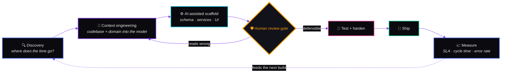
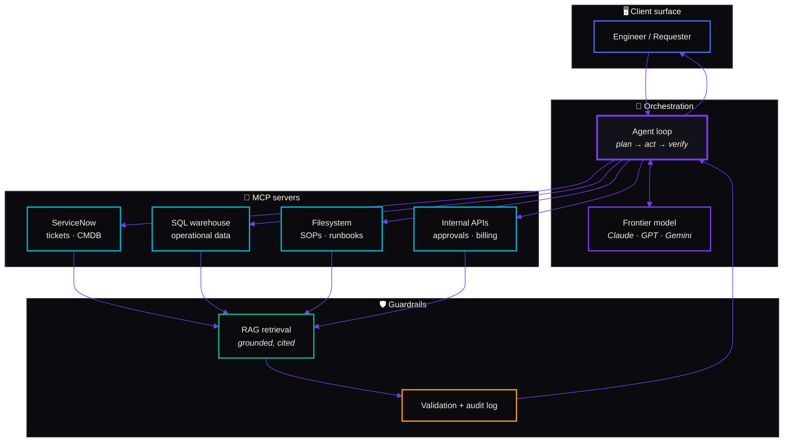
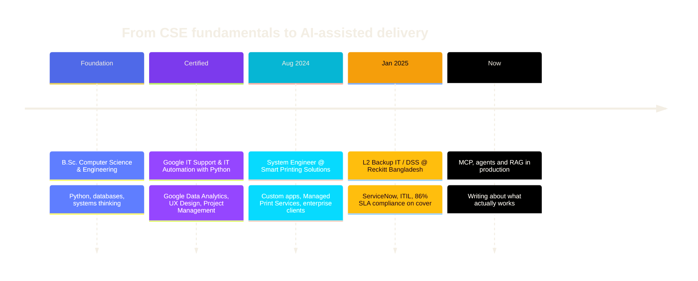

<!--
  ─────────────────────────────────────────────────────────────
   github.com/aniksarakash  ·  profile README
   Design language mirrors aniksarkerakash.com
   ink #030014 · bone #f3eee4 · blue #4f69e8 · purple #7c3aed
   cyan #06b6d4 · amber #f59e0b · pink #ec4899 · mint #10b981
  ─────────────────────────────────────────────────────────────
-->

 

 

##  &nbsp;`whoami`

I build the connective tissue between **AI**, **automation**, and the messy reality of **enterprise IT**.

By day I'm a System Engineer on the Software Solution Team at **Smart Printing Solutions**, shipping custom applications and Managed Print Services for enterprise clients — and the designated **backup L2 IT / Desktop Support (DSS)** for **Reckitt Bangladesh**, covering their sites whenever the primary engineer is out or an incident needs hands on the ground.

By night it means shipping AI-powered tools that compress months of grunt work into weeks.

> My favourite kind of project is one where a **90% time reduction** is on the table — usually because the original process was three legacy systems, two spreadsheets, and a person clicking buttons.

<table>
<tr>
<td width="50%" valign="top">

**📍 Based in** &nbsp;Badda, Dhaka, Bangladesh
**🛠️ Currently** &nbsp;System Engineer @ Smart Printing Solutions
**🔁 Also** &nbsp;L2 Backup DSS @ Reckitt Bangladesh
**🚗 On the ground** &nbsp;client site visits + remote support
**🎓 Foundation** &nbsp;B.Sc. Computer Science & Engineering

</td>
<td width="50%" valign="top">

**🎯 Focused on** &nbsp;MCP · AI agents · RAG · Python automation
**🛡️ Also hands-on** &nbsp;VM · Windows · M365 · XDR/EDR · network
**✍️ Writing about** &nbsp;LLM debugging, context engineering, ITSM
**📬 Reach me** &nbsp;`info@aniksarkerakash.com`
**💬 Ask me about** &nbsp;shipping AI code you can actually defend

</td>
</tr>
</table>

<b>🎓 &nbsp;Certifications — Google Professional Certificates</b>

 

| Certificate | Where it shows up in my work |
| :--- | :--- |
| **Project Management** | Scoping AI builds so a 6-month estimate becomes a 2-month delivery |
| **IT Automation with Python** | The automation layer under every report generator and approval flow |
| **UX Design** | Why the internal tools people actually *use* look the way they do |
| **Data Analytics** | SLA dashboards, ticket-ageing signals, operational reporting |
| **IT Support** | The L2/L3 discipline behind 86% SLA compliance on cover |

## 📊 &nbsp;Impact, measured

  

| `86%` | `90%` | `66%` | `15+` |
| :---: | :---: | :---: | :---: |
| SLA compliance on Reckitt cover | fastest single time reduction | faster project delivery, average | colleagues mentored on AI tooling |

## ⚡ &nbsp;How I actually build

The speed doesn't come from letting a model write the code and shipping it. It comes from **compressing the parts that were always mechanical**, then spending the saved time on review.

<blockquote>
<b>The gate is the whole point.</b> I don't merge code I can't explain line by line. Generated output is a first draft with a confident tone, not a decision — every branch gets read, every assumption gets named, and anything I can't defend in review goes back.
</blockquote>

<b>🤖 &nbsp;Model Context Protocol — how I wire LLMs into real systems</b>

 

MCP is an open standard for connecting LLM applications to external data and tools. In practice it's what turns a chatbot into something that knows your ticket queue, your asset register, and your SOPs — without pasting any of it into a prompt.

**What I build on top of it**

- 🕹️ &nbsp;Autonomous agents that run multi-step tasks with a human only at the decision points
- 🐝 &nbsp;Multi-agent systems where specialists split a problem and reconcile their answers
- 🔗 &nbsp;RAG pipelines grounded in organisational knowledge, with citations back to the source
- ⚖️ &nbsp;Workflow automation where the LLM makes the judgement call and the audit log makes it reviewable

<b>⚖️ &nbsp;Responsible AI — the non-negotiables</b>

 

| Principle | What it means on a Tuesday |
| :--- | :--- |
| **Understand every line** | If I can't explain why it's there, it doesn't merge — regardless of what generated it |
| **Review, don't accept** | Generated code is a first draft with a confident tone, not an answer |
| **Context over templates** | Solutions fitted to *this* org's constraints, not a generic scaffold with the names swapped |
| **Explainability** | Decisions an auditor can trace, not a black box with a good demo |
| **Bias & fairness** | Checked where the output touches people — routing, prioritisation, approvals |
| **Privacy first** | Sensitive data stays inside the boundary; retrieval is scoped and logged |
| **Security by default** | Least privilege on every tool an agent can reach |

## 🛡️ &nbsp;The other half of the job

Building the applications is one side. The other is keeping enterprise estates running — **remote support daily, on client sites when the fault needs hands on the hardware.** Most weeks contain both.

  

<table>
<tr>
<td width="50%" valign="top">

#### 🖥️ &nbsp;Endpoint, identity & security

**Defender XDR / EDR** &nbsp;alert triage, isolation, exclusions
**Antivirus** &nbsp;policy, exceptions, false-positive analysis
**Windows admin** &nbsp;GPO, imaging, patching, device compliance
**Microsoft 365** &nbsp;Entra ID, Exchange Online, Teams, SharePoint
**Licensing** &nbsp;assignment, tenant hygiene, access reviews

</td>
<td width="50%" valign="top">

#### 🌐 &nbsp;Infrastructure & network

**Virtualisation** &nbsp;VMware ESXi, Hyper-V, snapshots, resource contention
**Windows Server** &nbsp;AD, DNS, DHCP, file services, backup and restore
**Network faults** &nbsp;VLAN, firewall rules, VPN, routing, latency
**Diagnosis** &nbsp;packet capture, log correlation, root-cause writeups
**Remote support** &nbsp;fast triage before anyone drives anywhere

</td>
</tr>
</table>

> **On-site is a diagnostic tool, not a fallback.** Plenty of faults only reveal themselves in front of the rack — a link that renegotiates when the room warms up, a finisher that jams on one paper weight. I go when the evidence is physical, and solve it remotely when it isn't.

## 🖨️ &nbsp;Print management, built to the customer's rules

Print deployments fail when a product's defaults get imposed on an organisation that works differently. So the sequence is **audit → design → pilot → rollout → measure** — and the custom application work exists because the last mile is almost never in the box.

```mermaid
%%{init: {'theme':'base','themeVariables':{
  'primaryColor':'#12121a','primaryTextColor':'#f3eee4','primaryBorderColor':'#4f69e8',
  'lineColor':'#7c3aed','secondaryColor':'#0a0a0f','tertiaryColor':'#030014',
  'clusterBkg':'#0a0a0f','clusterBorder':'#2a2a3a','fontFamily':'JetBrains Mono, monospace','fontSize':'13px'}}}%%
flowchart LR
    A["🔎 Fleet audit<br/><i>volumes · devices · who prints what</i>"] --> B["📐 Solution design<br/><i>SafeQ · MyQ X · PaperCut · RSI</i>"]
    B --> C["🔌 Integration<br/><i>AD/Entra · cost centres · ERP</i>"]
    C --> D{"🧪 Pilot on one<br/>department"}
    D -->|"needs rework"| B
    D -->|"signed off"| E["🚀 Fleet rollout<br/><i>secure release · scan flows</i>"]
    E --> F["🧩 Custom application<br/><i>the gap the product left</i>"]
    F --> G["📊 Measure<br/><i>cost recovery · waste · uptime</i>"]
    G -.->|"tunes the next site"| A

    style A fill:#0a0a0f,stroke:#ec4899,stroke-width:2px,color:#f3eee4
    style B fill:#0a0a0f,stroke:#4f69e8,stroke-width:2px,color:#f3eee4
    style C fill:#0a0a0f,stroke:#f59e0b,stroke-width:2px,color:#f3eee4
    style D fill:#12121a,stroke:#f59e0b,stroke-width:3px,color:#f59e0b
    style E fill:#0a0a0f,stroke:#06b6d4,stroke-width:2px,color:#f3eee4
    style F fill:#0a0a0f,stroke:#7c3aed,stroke-width:2px,color:#f3eee4
    style G fill:#0a0a0f,stroke:#10b981,stroke-width:2px,color:#f3eee4
```

<table>
<tr>
<td width="50%" valign="top">

#### 🧭 &nbsp;Deployment & integration

**Platforms** &nbsp;`Ysoft SafeQ` `MyQ X` `PaperCut` `Ricoh RSI`
**Secure release** &nbsp;badge / PIN pull printing, follow-me
**Identity** &nbsp;AD & Entra ID sync, department mapping
**Accounting** &nbsp;cost centres, quotas, chargeback reporting
**Scan flows** &nbsp;scan-to-folder, email, and downstream systems

</td>
<td width="50%" valign="top">

#### 🧩 &nbsp;Where custom code comes in

**Bespoke reports** &nbsp;the breakdown finance asked for, not the built-in one
**System bridges** &nbsp;pushing usage into ERP, billing and approval flows
**Workflow glue** &nbsp;approval rules the platform can't express natively
**Provisioning** &nbsp;scripted onboarding across a mixed device fleet
**Dashboards** &nbsp;fleet health and consumables, ahead of the callout

</td>
</tr>
</table>

<blockquote>
Every one of those custom pieces started as the same sentence in a requirements meeting — <i>"can it also do…"</i>. The honest answer is usually <b>not out of the box</b>, and that gap is exactly where a small, well-scoped application earns its keep.
</blockquote>

## 🧰 &nbsp;Toolkit

<table>
<tr>
<td width="33%" valign="top">

#### 🧠 &nbsp;AI & Automation
`Claude Opus` `GPT-5` `Gemini Pro`
`DeepSeek` `Qwen` `GLM`

MCP integration · AI agents · RAG
Rapid development · Prompt/context engineering

</td>
<td width="33%" valign="top">

#### 💻 &nbsp;Development
`Python` `Django` `Flask` `JavaScript`
`PHP` `SQL` `PowerShell` `Solidity`

Web · Mobile · Backend
Clean architecture · Defensible code

</td>
<td width="33%" valign="top">

#### 🏗️ &nbsp;IT Infrastructure
`Windows Server` `VMware ESXi` `Hyper-V`
`Microsoft Azure` `Active Directory` `Entra ID`

ServiceNow · ITIL · Defender XDR / EDR
DNS · DHCP · VLAN · VPN · firewalls

</td>
</tr>
<tr>
<td width="33%" valign="top">

#### 📈 &nbsp;Data & Analytics
`MS SQL` `MySQL` `Tableau`
`PyTorch` `NumPy` `Pandas`

Operational dashboards
SLA & cycle-time reporting

</td>
<td width="33%" valign="top">

#### 🖨️ &nbsp;Managed Print Services
`Ysoft SafeQ` `MyQ X`
`PaperCut` `Ricoh RSI`

Fleet design & deployment
Secure release · Cost recovery

</td>
<td width="33%" valign="top">

#### 🎯 &nbsp;Delivery
`Project Management` `ITIL`
`Technical Support` `UX Design`

Stakeholder scoping
L2/L3 incident response

</td>
</tr>
</table>

## 🚀 &nbsp;Featured work

<table>
<tr>
<td width="50%" valign="top">

### 🎫 &nbsp;Custom CRM Ticketing System
 

End-to-end CRM with integrated ticketing, automated workflow routing and real-time dashboards.

- ⚡ 40% improvement in ticket resolution time
- 🔄 Workflow automation across three legacy touchpoints
- 📊 Live operational dashboards for team leads

`Python` `Django` `PostgreSQL`

</td>
<td width="50%" valign="top">

### 📄 &nbsp;Complex Report Generation App
 

Multi-format report engine (PDF, Excel) with a web front end and parameterised templates.

- 🤖 Automated data collection across sources
- ✍️ 75% reduction in manual data entry
- 🎛️ Fully customisable report parameters

`Python` `Flask` `ReportLab`

</td>
</tr>
<tr>
<td width="50%" valign="top">

### ✅ &nbsp;Bill Approval System
 

Bill and conveyance approval with rules-based routing, notifications and full workflow management.

- 🏃 60% faster approval cycles
- 🧭 Automated multi-tier routing
- 🌿 Fully paperless audit trail

`Django` `PostgreSQL` `REST APIs`

</td>
<td width="50%" valign="top">

### 🎓 &nbsp;Blockchain-Degree

Issuing and verifying academic degrees on-chain with Solidity smart contracts — tamper-evident credentials, instant verification.

- 🔐 On-chain issuance & revocation
- 🔎 Public verification endpoint

`Solidity` `Django` `Web3.py`

**[→ View repository](https://github.com/aniksarakash/BlockchainDegree/)**

</td>
</tr>
<tr>
<td colspan="2" valign="top">

### 🖼️ &nbsp;SteganoGAN Web
 

High-capacity image steganography using Generative Adversarial Networks, wrapped in a web interface so the model is usable by people who don't write PyTorch. &nbsp;`GANs` `PyTorch` `Steganography`

**[→ View repository](https://github.com/aniksarakash/steganoGANweb)**

</td>
</tr>
</table>

## 🗓️ &nbsp;The path here

## ✍️ &nbsp;From the blog

I write about AI-assisted development, debugging LLM output, and troubleshooting methodology at **[aniksarkerakash.com/blog](https://aniksarkerakash.com/blog/)**.

<!-- BLOG-POST-LIST:START -->
- [Did they nerf it? What actually happens when a model gets worse](https://aniksarkerakash.com/blog/did-they-nerf-it)
- [The receipts: auditing the Claude Opus 5 optimization ecosystem](https://aniksarkerakash.com/blog/opus-5-ecosystem-audit)
- [Quantum will not hand you AGI: the arrow points the other way](https://aniksarkerakash.com/blog/quantum-will-not-hand-you-agi)
- [The microscope we built for the thing we grew](https://aniksarkerakash.com/blog/the-microscope-we-built-for-the-thing-we-grew)
- [Prompt engineering inverted: the instructions that used to help now hurt](https://aniksarkerakash.com/blog/prompt-engineering-is-context-engineering)
<!-- BLOG-POST-LIST:END -->

<a href="https://aniksarkerakash.com/blog/"><b>Read everything →</b></a>

## 📈 &nbsp;GitHub, live

<!-- Self-hosted: regenerated daily by .github/workflows/stats.yml.
     The public github-readme-stats instance is paused (503) and
     github-profile-trophy returns 402, so we render our own. -->

  

  

> [!NOTE]
> **100% of the last 12 months is private enterprise work.** The CRM, the report engine and the approval system all ship inside client infrastructure, so the public contribution graph shows the visible slice, not the job. The card above counts the private volume because my profile publishes it — and the [generator](./scripts/generate-stats.mjs) keeps a signed-off baseline in [`assets/stats.json`](./assets/stats.json), so if that visibility ever changes the number degrades loudly instead of silently reading zero.

### 🐍 &nbsp;Contribution snake

<picture>
  <source media="(prefers-color-scheme: dark)"  srcset="https://raw.githubusercontent.com/aniksarakash/aniksarakash/output/github-snake-dark.svg" />
  <source media="(prefers-color-scheme: light)" srcset="https://raw.githubusercontent.com/aniksarakash/aniksarakash/output/github-snake.svg" />
  
</picture>

## 🤝 &nbsp;Let's talk

 

  

  

<i>Built the same way I build everything else — read every line, ship it, measure it.</i>

